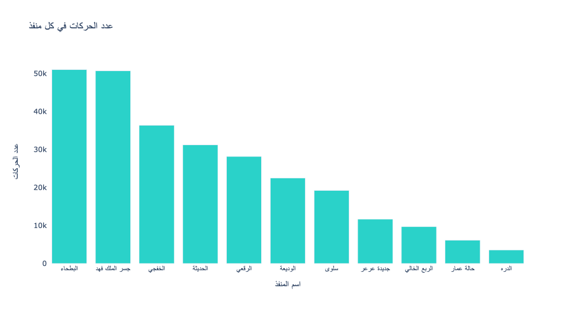
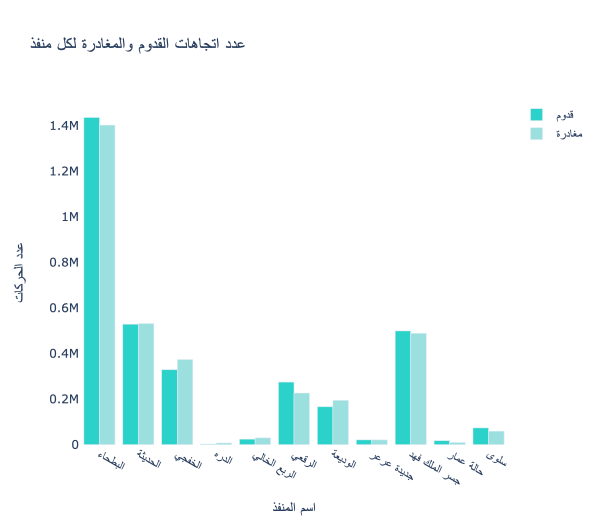
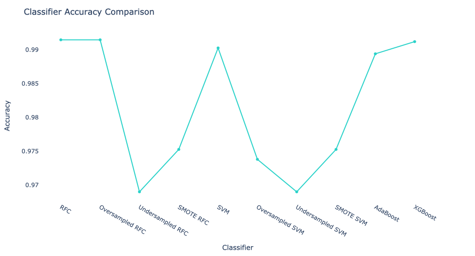
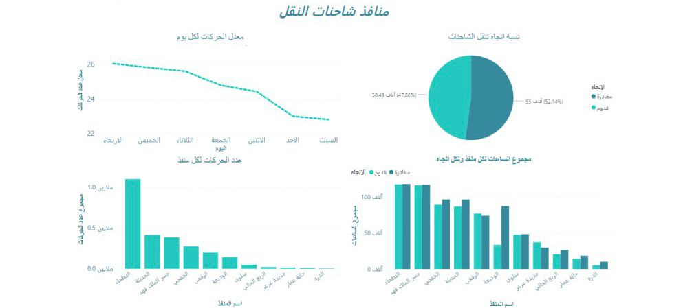

#  تنبؤ حركة الشاحنات في المنافذ البرية
#  اعضاء الفريق 
                                             
| Task   | الاسم  | 
|--------|---------|
|  EDA, Visualization, Readme File | ملاك القثامي |
|EDA , Encoding , Dashboard|سديم فِهره |
|EDA, Machine Learning Models, Final Result Chart | عبدالله التركي | 
## المقدمة
هذا الملف  يقدم نظرة عامة عن مشروع تنبؤ حركة المنافذ البرية الذي يركز على توقع عدد الحركات في المنافذ البرية في المملكة العربية السعودية. يستخدم المشروع مجموعة البيانات التي تحتوي على معلومات حول المنافذ البرية، بما في ذلك اسم المنفذ، التاريخ، اليوم، الساعة، الاتجاه (قدوم أو مغادرة)، وعدد الحركات. إجمالي عدد الحركات في مجموعة البيانات هو 6،721،522.
## نظرة عامة على مجموعة البيانات [اضغط هنا](https://od.data.gov.sa/Data/ar/dataset/port-traffic)
تحتوي مجموعة البيانات على الأعمدة التالية: 
  *  اسم المنفذ البري 
  *  تاريخ تسجيل الحركة.
  *  يوم الأسبوع.
  *  ساعة تسجيل الحركة.
  * اتجاه الحركة (قدوم أو مغادرة).
  *  عدد الحركات المسجلة.
### تشمل مجموعة البيانات بيانات من 11 منفذًا بريًا مختلفًا في المملكة العربية السعودية.
 ## التصور
 يحتوي المشروع على التصورات التالية:
 ##  يوفر هذا الرسم البياني نظرة عامة على توزيع حركة المرور بين المنافذ المختلفة.

  
   
 
 
  ## يعرض هذا الرسم البياني تدفق حركة المرور من حيث القدوم والمغادرة لكل منفذ.
 
 
 ## يعرض هذا الرسم البياني مقارنة نسبة الدقة بين النماذج
 
  

## النماذج :
* Random Forest Classifier
* Support Vector Machines (SVM) Classifier
*  Ensemble Methods (Boosting)

                                                               

                           

 

## Evaluation:

| Model                  | Class   | Precision | Recall | F1-score | Accuracy |
| ---------------------- | ------- | --------- | ------ | -------- | -------- |
| Random Forest                    | 0       | 0.96      | 1.00   | 99     |          |
|                        | 1       | 0.99      | 0.87   | 0.80     |          |
|                        | 2       | 0.97      | 0.80   | 0.93     |          |
|                        | Accuracy|           |        | 0.99     | 0.99     |
| SVM                    | 0       | 0.99      | 1.00   | 1.00     |          |
|                        | 1       | 0.99      | 0.81   | 0.89     |          |
|                        | 2       | 0.97      | 0.84   | 0.90     |          |
|                        | Accuracy|           |        | 0.99     | 0.99     |
| Boosted (XGBoost)      | 0       | 0.99      | 1.00   | 1.00     |          |
|                        | 1       | 0.98      | 0.85   | 0.91     |          |
|                        | 2       | 0.97      | 0.84   | 0.90     |          |
|                        | Accuracy|           |        | 0.99     | 0.99     |
| Boosted (AdaBoost)     | 0       | 0.99      | 1.00   | 0.99     |          |
|                        | 1       | 0.98      | 0.81   | 0.89     |          |
|                        | 2       | 0.99      | 0.83   | 0.90     |          |
|                        | Accuracy|           |        |          | 0.99     |

# تم إنشاء لوحة معلومات باستخدام باور بي اي
## يعرض هذا الرسم البياني مقارنة نسبة الدقة بين النماذج
 
# تم إنشاء لوحة معلومات باستخدام باور بي اي
  الخاتمة

بعد الاطلاع نبذة على موجزة عن البيانات واكتشافها وتحليلها، لاحظنا أنه من الضروري التحقق من تجانسية البيانات لضمان حصولنا على نتائج دقيقة وموثوقة. يُعد التوازن والتجانس في البيانات أمرًا أساسيًا قبل أن ننطلق في عملية التحليل. وعبر مراحل اختيار النماذج الثلاثة، تم انتقاء نموذج Ensemble Methods (Boosting)، والذي أظهر نتائج متفوقة نظرًا لقدرته على تجميع مجموعة من النماذج الفرعية وتعزيز أدائها بشكل تدريجي. ومع هذا، يظل الاختيار النهائي للنموذج معتمدًا على نوع المشكلة التي نحتاج لحلها. يمكننا بشكل عام اعتماد أساليب متنوعة تبعًا لظروف ومتطلبات كل حالة.

                                                                                                                                          
                                                                                                                                          
