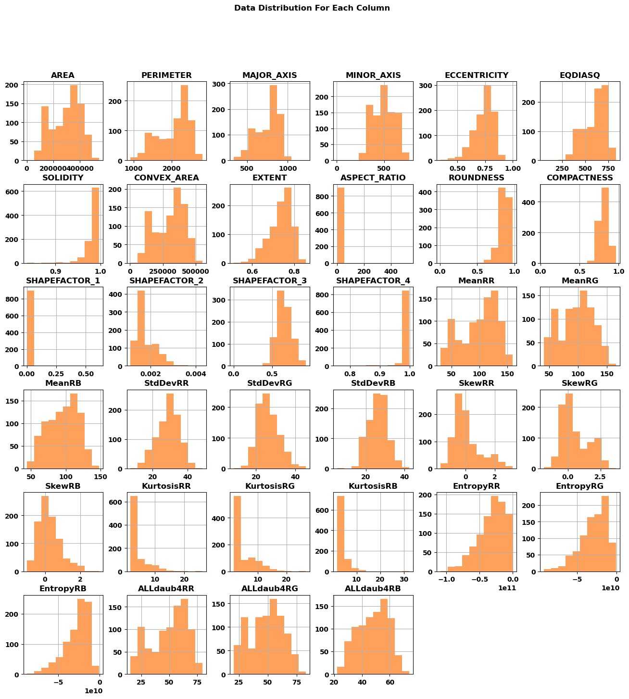
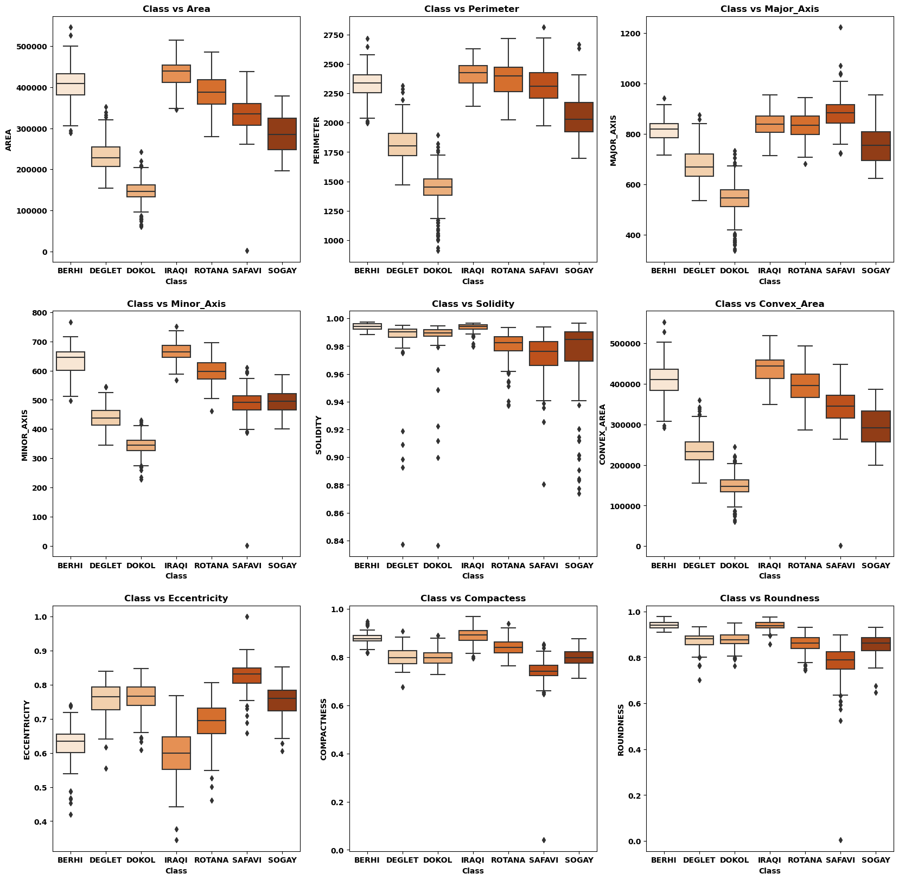
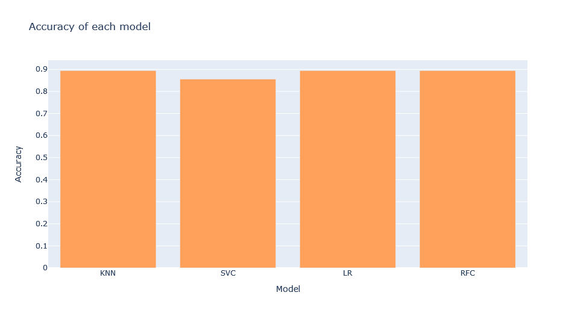

# Date Fruit Datasets Machine Learning

## Team Members:
| **Hajar** | **Teaf** | **Rayan** | duties
|:---------:|:--------:|:---------:|------:
|                  |                  |:white_check_mark:|EDA
|:white_check_mark:|                | |Handling Outliers
|:white_check_mark:|:white_check_mark:| |Building Models
|                  |                  |:white_check_mark:|README file

## Goal:
Saudi Arabia is currently focusing on localizing factories. It is important to note that Saudi Arabia has the largest Dates fruit farms worldwide. We have obtained a dataset containing various metrics for 7 types of Dates: Barhee, Deglet Nour, Sukkary, Rotab Mozafati, Ruthana, Safawi, and Sagai. Our belief is that by utilizing machine learning techniques, we can help Saudi factories categorize the different types of Dates efficiently using AI intelligence. This approach is expected to result in cost and time savings.

## Dataset 
 [Kaggle: Date Fruit Datasets](https://www.kaggle.com/datasets/muratkokludataset/date-fruit-datasets)

