# Classification on Mushrooms Dataset 🍄

## Introduction and Objectives 🎯
For this project, the main goal was to use three or more **Machine Learning** algorithms to classify whether a mushroom is **poisonous** or **edible**. In this report, we will dive into how we dealt with the dataset, including EDA and cleaning. We will also cover the Machine Learning models used, their results, and provide explained charts to get a better understanding on the dataset features.

## Team Members and Tasks 👥
|Task |Khalid Alhumaidan | Rakan Almuwainie | Anwar Almutlaq |
|-|-|-|-|
|EDA and cleaning|✌|✌|✌
|Machine Learning modeling|✌ |✌ |✌
|Feature engineering and selection|✌| |✌
|Plotting charts|✌|✌|✌
|Creating Dashborad|  | |✌
|Creating README|✌|✌|✌ 

## Dataset Overview and Source 📑

The dataset for this project was obtained from [UCI](https://archive.ics.uci.edu/dataset/73/mushroom). It provides species descriptions of mushrooms. Each species has been classified as either definitely edible or definitely poisonous. 

## EDA and Cleaning 🧹

To prepare and clean the dataset the following actions were taken:

- Renaming the columns.
- Handling missing values in the stalk-root column by determining the other features' relationships to each stalk-root value.
- Replacing the shortcuts to the full names.

## Feature Selection and Engineering 👷
For this step, all of the columns in the dataset are categorical types. Therefore, we decided to use **Label Encoding** initially to convert each category into a corresponding numerical value. As a result, the columns now contain numerical values. To further improve our results, we then used a heatmap plot to identify the columns that have positive correlation with the target column.
Here are the columns we choose and their values:

|Population |Cap color |Gill size | Spore print color  |Veil color |bruises |cap shape|cap surface|gill attachment|
|-----------|----------|----------|--------------------|-----------|--------|---------|-----------|---------------|
|abundant   |brown     |broad     |black               |brown      |Yes     |convex   |scaly      |free           |
|clustered  |buff      |narrow    |brown               |orange     |No      |flat     |smooth     |attached       |
|numerous   |cinnamon  |          |buff                |white      |        |knobbed  |fibrous    |               |
|scattered  |gray      |          |chocolate           |yellow     |        |bell     |grooves    |               |
|several    |green     |          |green               |           |        |sunken   |           |               |
|solitary   |pink      |          |orange              |           |        |conical  |           |               |
|           |purple    |          |purple              |           |        |         |           |               |
|           |red       |          |white               |           |        |         |           |               |
|           |white     |          |yellow              |           |        |         |           |               |
|           |yellow    |          |                    |           |        |         |           |               |

---

To clarify more, here are some images that explain the mushrooms:

- Mushroom Structure:

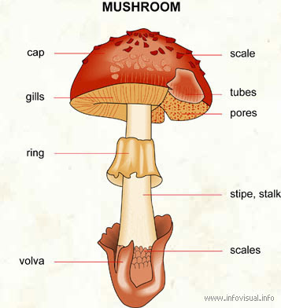

---

- How bruises look like in a mushroom:
  
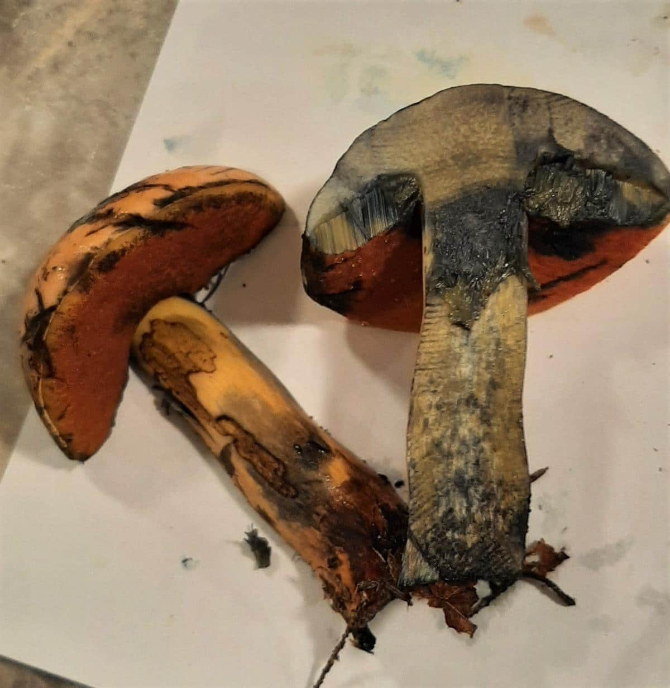

---

- Gill attachments:

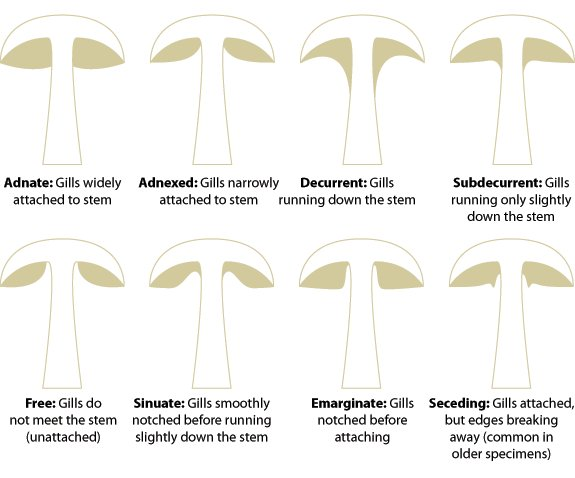

---
- Mushroom cap shape:

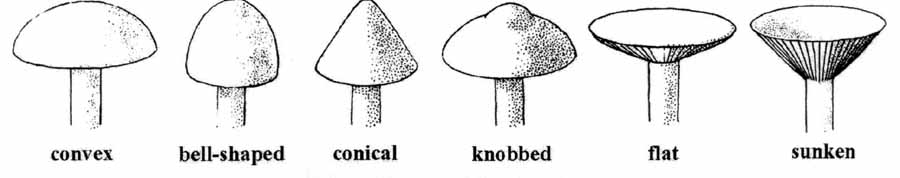

---
- Mushroom cap surface:

---

## Charts and Insights 📊
The project includes several charts showing the differences between poisonous and edible mushrooms:

### 1. Edible vs Poisonous 
   
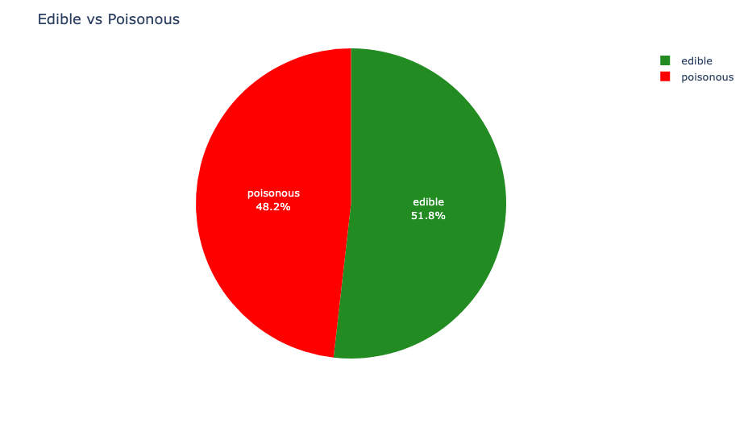

### insight:
- As shown in the diagram above. The percentages are very close to one another. However, the edible is slightly higher.
---

### 2. Mushroom distribution based on classes and bruises 

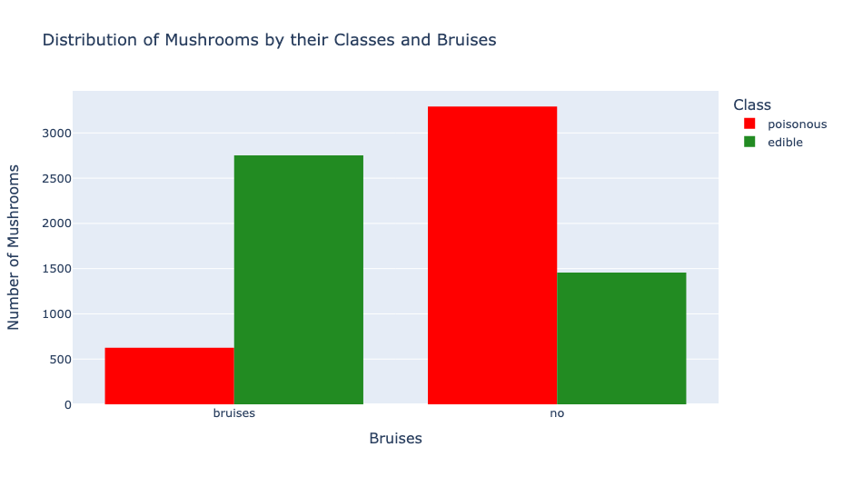

### insight:
- We notice that bruised mushrooms tend to be edible, hence, mushrooms without bruises are probably poisonous.

---
### 3. Distribution of Mushrooms by their Classes and Cap Shapes 
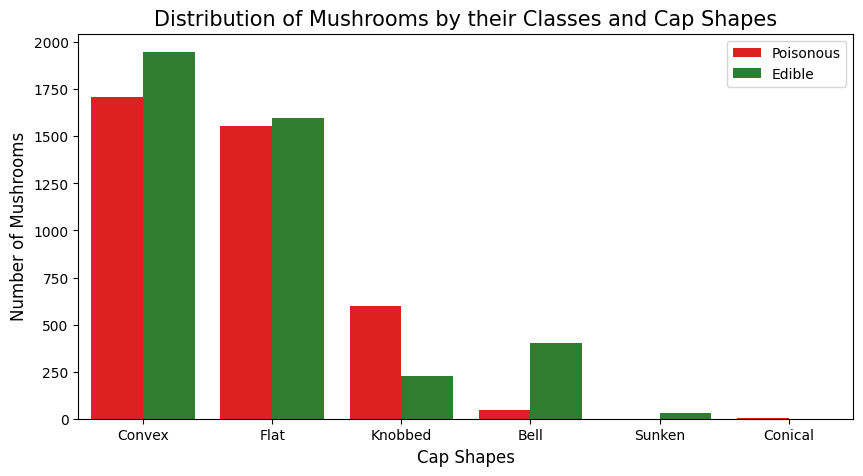

### insight:
- Apparently most of the mushrooms are either convex shaped or flat shaped.
---

### 4. Distribution of Mushrooms by their Classes and Cap Surfaces 
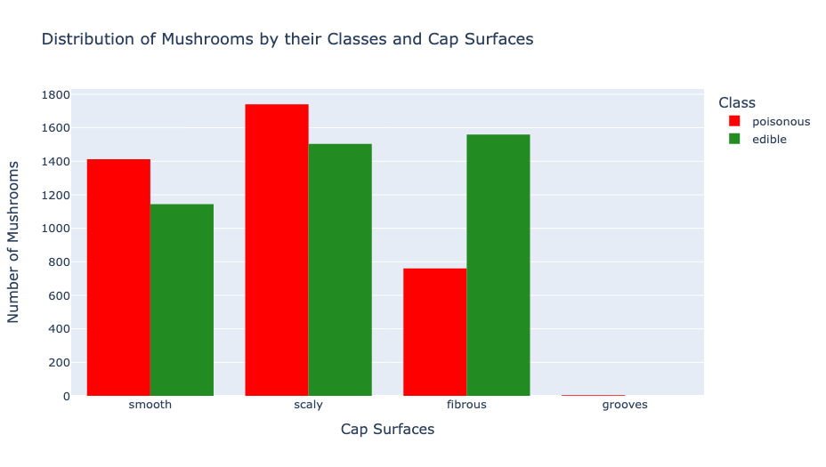

### insight:
- The smooth and scaly surfaces appears to be more poisonous, on the other hand the fibrous is more edible.
---

### 5. Mushroom distribution based on classes and Cap color 

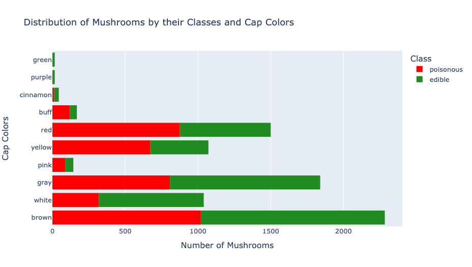

### insight:
- It is obvious that most mushrooms with red, yellow, pink, or buff caps are poisonous. Brown, white, gray, purple, green, and cinammon, on the other hand, are most likely edible.
---

### 6. Distribution of Mushrooms by their Classes and Habitats 

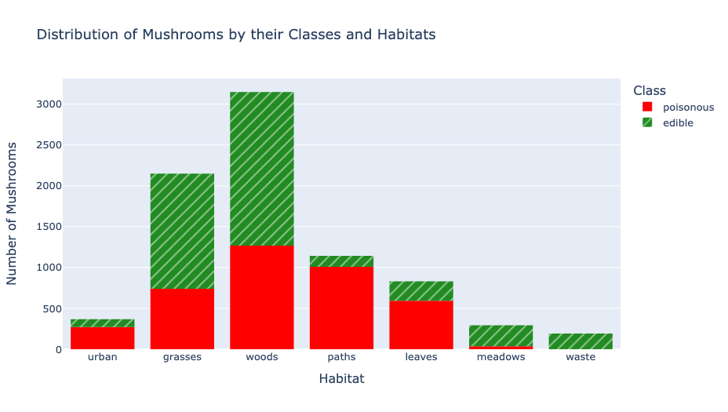

### insight:
- Most of mushrooms grow on the woods and grasses, and it's difficult to distinguish which is poisonous and which is not.
---

### 7. heatmap 

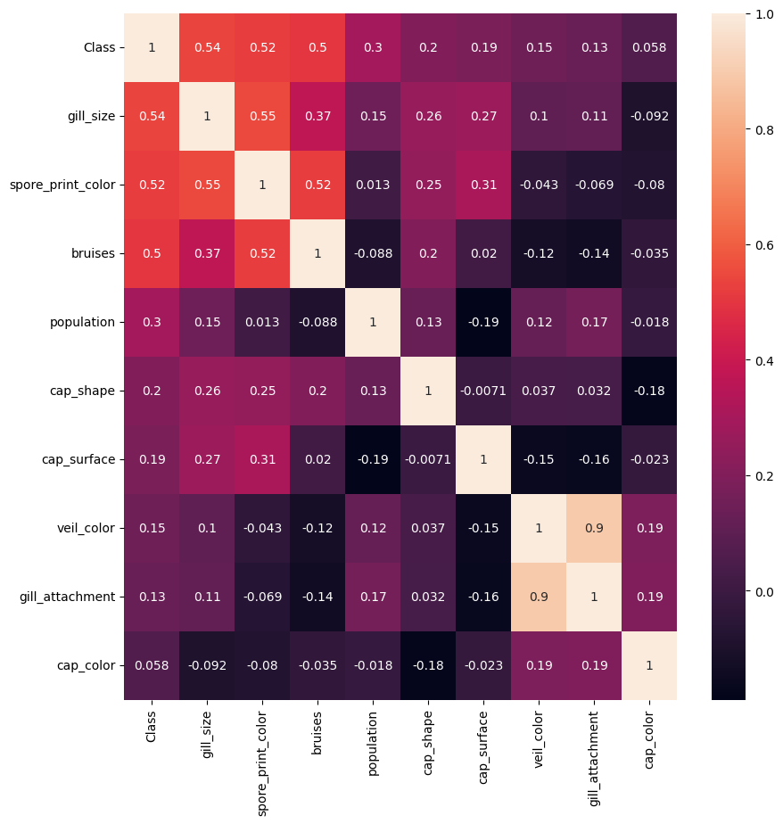

### insight:
- The heatmap shows the features that we're using to train the models.
---

## Models Results

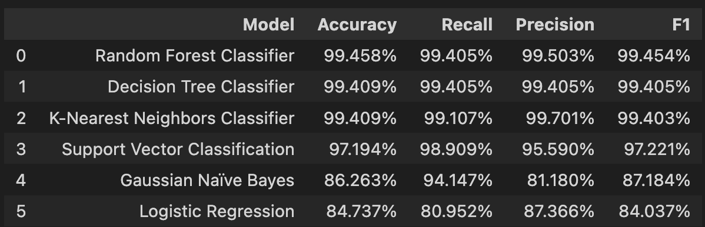

It appears that: Random forest tree, decision tree, and Knn got the highest rating overall in this problem. All these algorithms do well with non-linear problems, perhaps maybe that's the reason?
