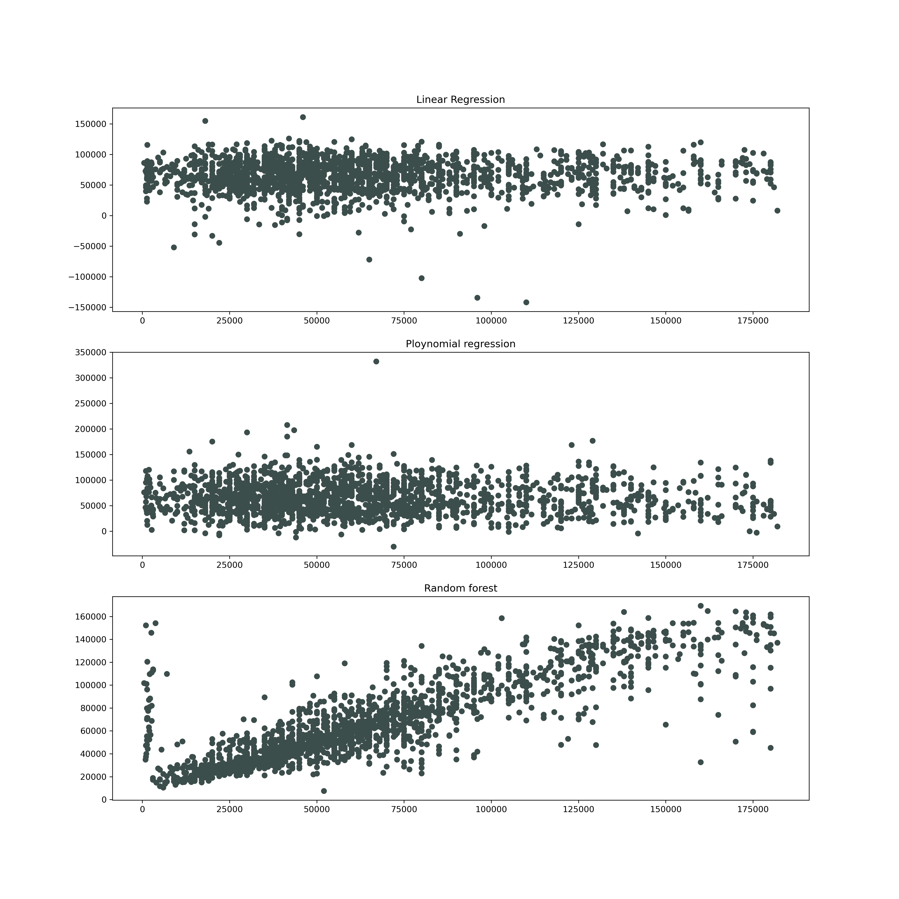
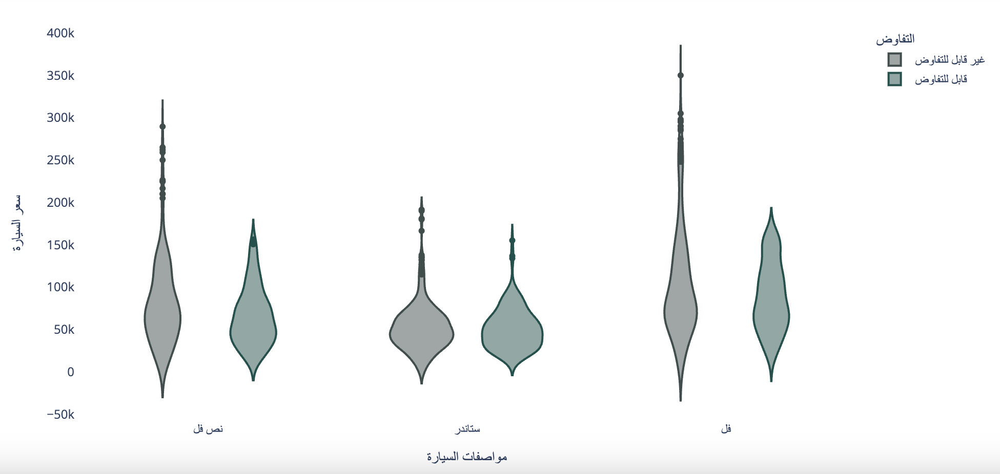
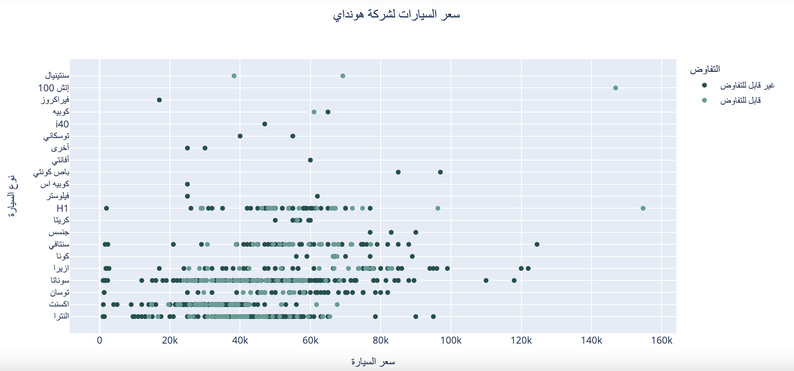

## Team Members
| Abdullah | Hussain  | Mohammed | Raghad
|-|-|-|-|
| Data cleaning | Data cleaning | Data cleaning | Data cleaning 
| Ploynomial Regression | Linear regression | Data visualization | Dashboard|
| Missing data | Random forest | Handling Outliers | Data Visulization
| Feature Engineering | Feature Engineering
| README | README |  | 

# Introduction 
Used cars prices vary a lot even between the same car, using a data set that has considerably fair prices we aim to build the most accurate model which we can use to predict the price of any car. Going through 3 different machine learning algorithms and comparing their metrics. 
#### *Models used:*
- Linear regression
- Polynomial regression
- Random forest 
### **Problems**
- In engine size there were nulls and we replaced them by grouping each car based on options column to fill it with the most accurate data 
- Most columns were strings so we used labeling 
- Some prices were not available and it was for bidders to set the price ( using our model we will predict the price of these cars)

### **Objectives**
- Choose the best machine learning model to evaluate car prices given the features we have.
- Try different methods to choose the best data set and random sample 
- Report appropriate evaluation metrics for each model 

# **Dataset overview**
Certainly! Here's the overview of the columns in table format for Markdown:

| Column       | Description                                       |
|--------------|---------------------------------------------------|
| Make         | Manufacturer or make of the vehicle              |
| Type         | Type or category of the vehicle                  |
| Year         | Manufacturing year of the vehicle                |
| Origin       | Origin or source of the vehicle                  |
| Color        | Color of the vehicle                             |
| Options      | Additional options or features of the vehicle    |
| Engine_Size  | Engine size of the vehicle            |
| Fuel_Type    | Type of fuel the vehicle uses                    |
| Gear_Type    | Type of gear transmission (manual, automatic)    |
| Condition    | Condition of the vehicle (used, new)             |
| Mileage      | Mileage or distance traveled by the vehicle      |
| Region       | Region or location associated with the listing   |
| Price        | Price of the vehicle (should be numeric)         |
| Negotiable   | Boolean indicating whether price is negotiable   |

### **Data Source**
https://www.kaggle.com/datasets/turkibintalib/saudi-arabia-used-cars-dataset

## **Models**
### Linear regression

###### Linear regression metrics:
- R-Squared: 0.42
- MAE: 22689.94
- MSE: 1009129859.14
- RMSE: 31766.80

### Ploynomial regression 

###### Ploynomial regression metrics:
- R-Squared: 0.41
- MAE: 19590.81
- MSE: 834403470.31
- RMSE: 28886.04

### Random forest 

###### Random forest metrics:
- R-Squared: 0.76
- MAE: 37083.74
- MSE: 2202560110.47
- RMSE: 46931.44

### This plot shows how all of the 3 algorithms predictions compared

### **Conclusion and findings**
In our case using Random forest regression had the best accuracy of predicting cars prices with an R^2 value of 0.76, considering the cars market and since everyone decides for him the price he wants for his car we think ~20% change in the price of a car is expected considering some other features that were not available in this data set.

### Here are some insights that gives an overview of the dataset

#### 1. Cars Percentages based on Options

#### 2. Cars Percentages based on Gear Type

#### 3. Cars Price distribution for Mazda

#### 4. Top 10 Used Cars for sale 

#### 5. Price Comparison between Top 5 Makers

#### 6. Negotiable vs Non-Negotiable Cars Prices based on Options

#### 7. Cars Distribution of Prices for Mazda 

#### 8. Cars Distribution of Prices for Hyundai

